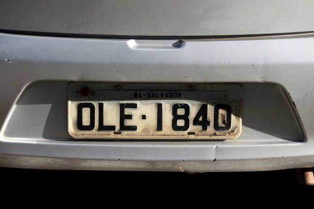
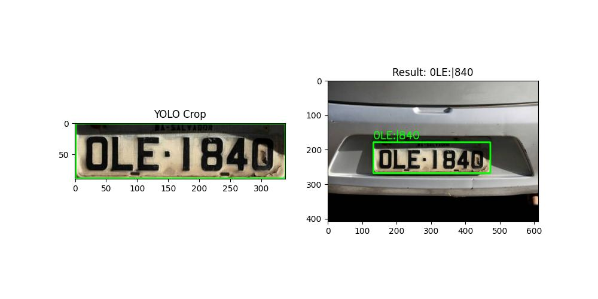

# 🚙 AI License Plate Reader (YOLOv8 + EasyOCR)

An advanced Automatic Number Plate Recognition (ANPR) system. Unlike traditional CV methods that rely on edge detection, this project uses a custom-trained **YOLOv8** model to detect plates in challenging conditions and **EasyOCR** to read the characters.

## 🧠 Project Architecture
The pipeline consists of two Deep Learning stages:
1.  **Object Detection (YOLOv8):**
    * Trained on a dataset of 400+ cars.
    * detects the location of the license plate even in low light or at angles.
    * Model weights: `best.pt` (Fine-tuned YOLOv8 Nano).
2.  **Optical Character Recognition (EasyOCR):**
    * Takes the cropped plate image.
    * Uses a ResNet + LSTM network to read the text.

## 🛠️ Tech Stack
* **Training:** YOLOv8 (Ultralytics), PyTorch (GPU Accelerated).
* **Inference:** OpenCV, EasyOCR.
* **Hardware Used:** NVIDIA RTX 4050 (Training time: ~3 mins for 20 epochs).

## 📸 Demo Result
| YOLO Crop | Final Detection |
| :---: | :---: |
|  |  |


## 🚀 How to Run
1.  **Clone the repo:**
    ```bash
    git clone https://github.com/EvansDesikan/AI_License_Plate_Reader.git
    cd AI_License_Plate_Reader
    ```
2.  **Install dependencies:**
    ```bash
    pip install -r requirements.txt
    ```
3.  **Run the AI Reader:**
    ```bash
    python ai_plate_reader.py
    ```

## 📂 File Structure
* `train_yolo.py`: Script used to train the model on the Kaggle dataset.
* `ai_plate_reader.py`: The main inference script that loads `best.pt` and scans images.
* `best.pt`: The trained YOLO weights.