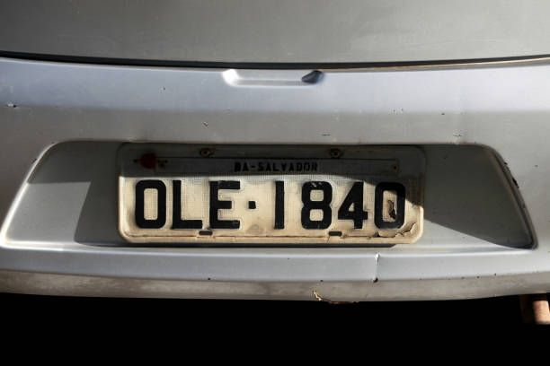
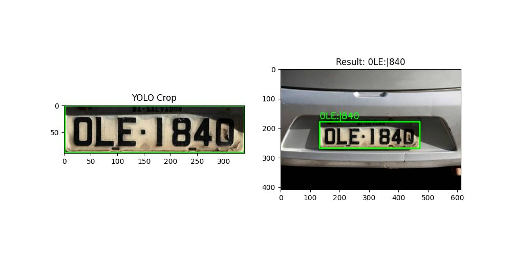
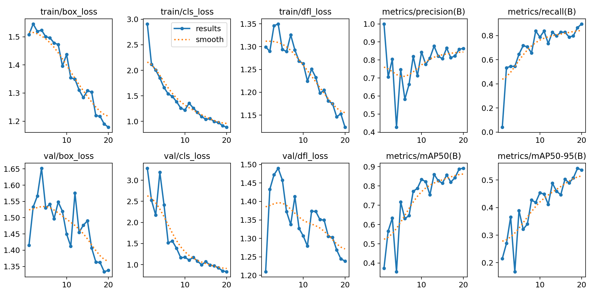

# Licence plate reader: YOLOv8 detection + EasyOCR

Detects licence plates in car photos with a fine-tuned **YOLOv8n** and reads the characters with **EasyOCR**.

**Detection results (validation set, 20 epochs, 640 px):**

| Precision | Recall | mAP@0.5 | mAP@0.5:0.95 |
| --- | --- | --- | --- |
| 0.864 | 0.897 | 0.891 | 0.536 |

Training took about 3 minutes on an RTX 4050 laptop GPU. Character-level OCR accuracy has not been measured yet.

| Input | Detection and reading |
| :---: | :---: |
|  |  |



## Pipeline

1. `prepare_data.py` converts the Pascal VOC XML annotations into YOLO format and splits train/val (creates `yolo_dataset/`).
2. `train_yolo.py` fine-tunes YOLOv8n (pretrained weights download automatically) on one class, `plate`.
3. `ai_plate_reader.py` / `plate_scanner.py` detect the plate, crop it and run EasyOCR. `batch_scan.py` processes a folder.

## Run it

```bash
python3 -m venv .venv && source .venv/bin/activate
pip install -r requirements.txt

# Inference with the included trained weights (best.pt)
python ai_plate_reader.py

# Retrain: download the Kaggle "Car License Plate Detection" dataset (433 images, VOC XML),
# extract it to dataset/images and dataset/annotations, then
python prepare_data.py
python train_yolo.py
```

## Files

| File | Purpose |
| --- | --- |
| `best.pt` | Trained detector weights (YOLOv8n, 1 class) |
| `prepare_data.py` | VOC XML to YOLO conversion and split |
| `train_yolo.py` | Training |
| `ai_plate_reader.py`, `plate_scanner.py`, `batch_scan.py` | Detection + OCR |
| `docs/` | Training curves, precision-recall curve, validation predictions |

## Next steps

- Measure OCR character accuracy on a labelled test set.
- Export to ONNX/TensorRT and benchmark on a Jetson.

## Tech

Ultralytics YOLOv8 · PyTorch · EasyOCR · OpenCV
